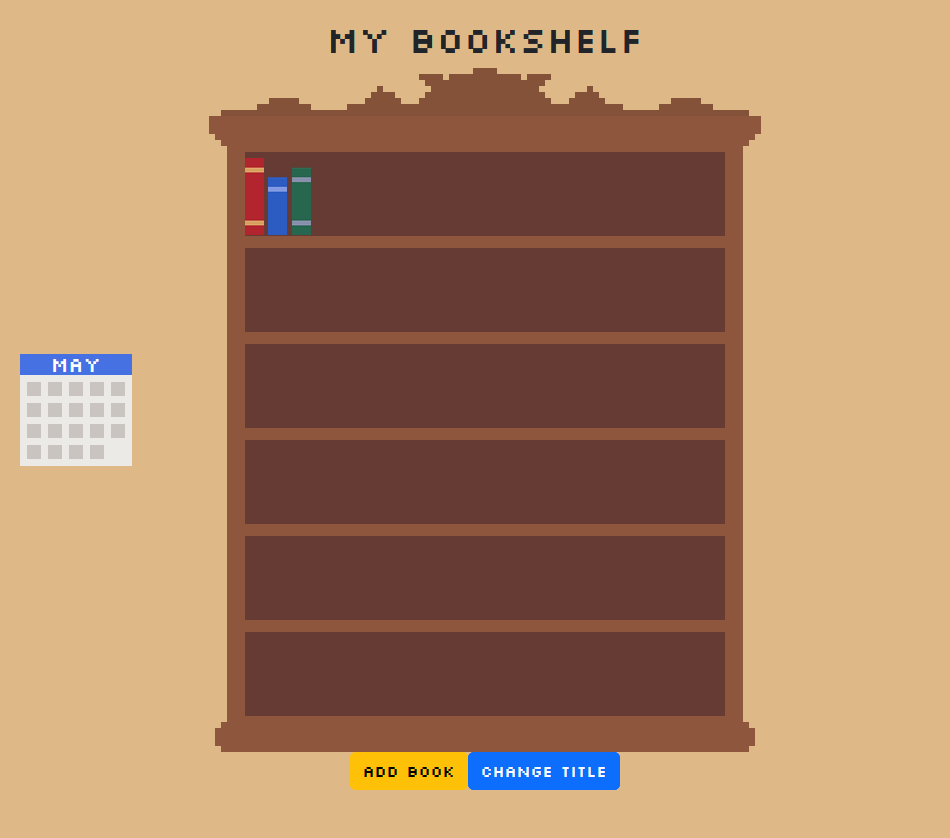
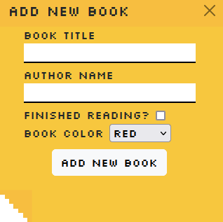
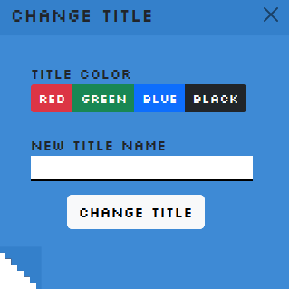
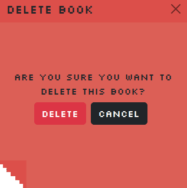
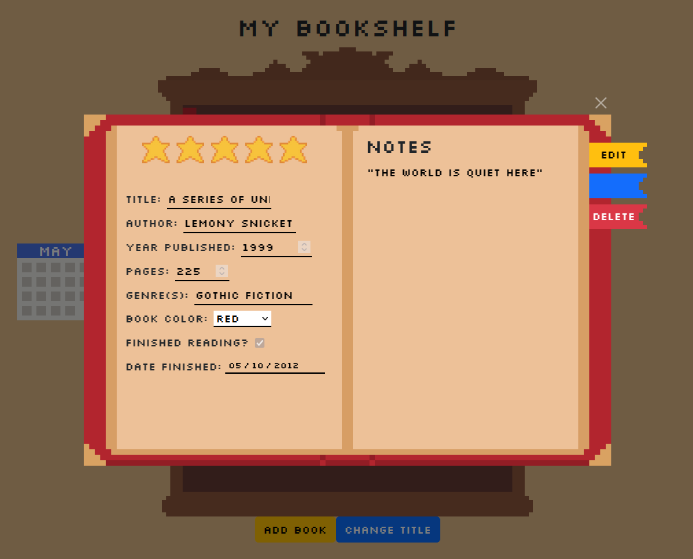
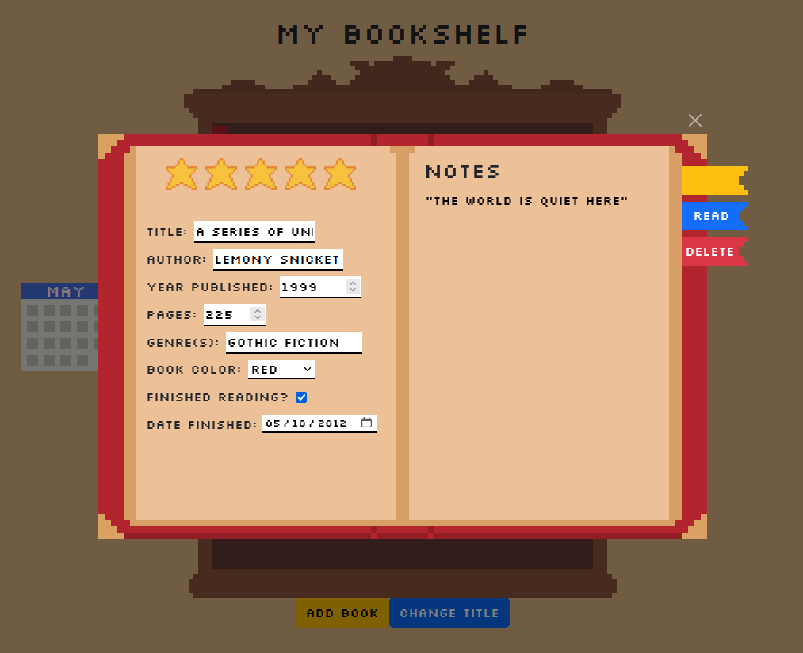

# My Bookshelf

  <h3>Access the bookshelf: <a href="https://paper-clips.github.io/MyBookshelf/">link</a>

The website allows users to keep track of the books they've read, recently or even in the past. Users can easily add books to their virtual bookshelf by inputting the book's title, author, and a rating system that ranges from one to five stars, as well as other information. Additionally, they can add personal notes about each book.

**NOTE:** *If you refresh the page or close it, the data you enter will be erased.*    

## Adding a new book

## Changing the title

## Deleting a book

## Front of book

## Read mode

## Edit mode

